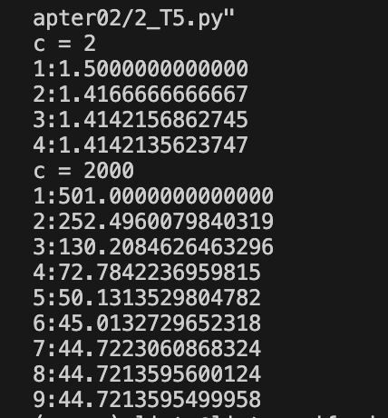
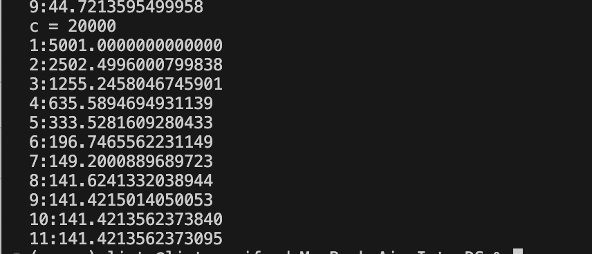
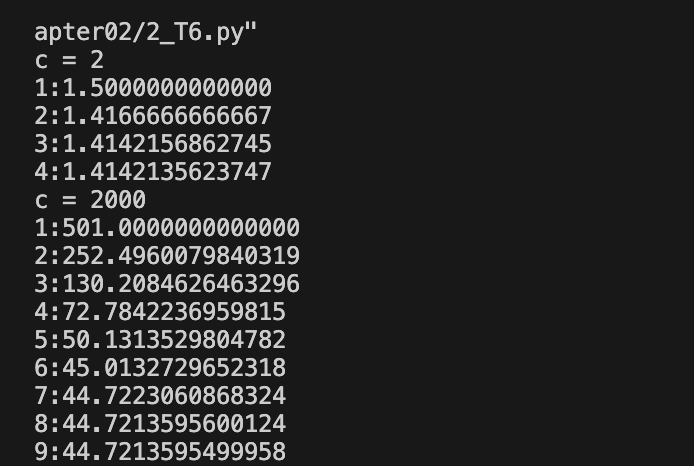
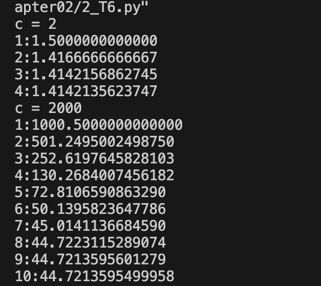
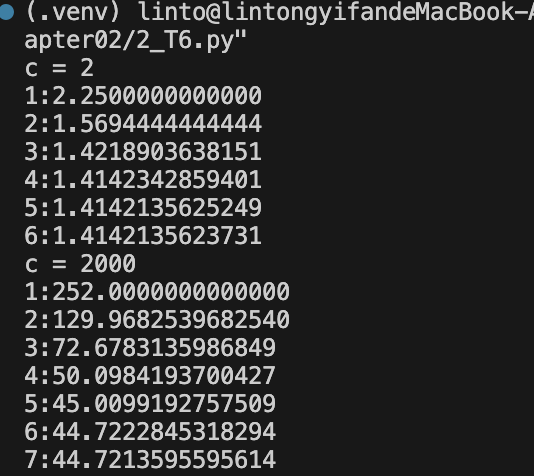

# This is the assignment of Chapter 2

## T1

(1) [result](./1.png)

(2) 我先从较小的2，3，4等数开始，试图寻找规律。在这个过程中可以发现所有大于等于4的整数，都可以被拆分为若干个2与若干个3的和。而将这些更大的数拆成2与3的数列，显然能得到更大的乘积。而两个3比三个2拥有更大的乘积，因此应当拆成尽量多的3，剩余的用2填补。

(3)[code](./2_T1.py)

## T2

增长速度相当快。

[code](./2_T2.py)

[result](./2.png)

## T3

得到两种方案：

1. 农夫带羊过河
农夫返回
农夫带狼过河
农夫带羊返回
农夫带菜过河
农夫返回
农夫带羊过河

2. 农夫带羊过河
农夫返回
农夫带菜过河
农夫带羊返回
农夫带狼过河
农夫返回
农夫带羊过河

[code](./2_T3.py)

[result](./3.png)

## T4

[code](./2_T4.py)

[result](./4.png)

## T5

[code](./2_T5.py)

c增量很大，循环次数却增加得不快。

## T6

[code](./2_T6.py)

g = c / 2

g = c

g = c / 4

可以发现可能会有所不同，但在要求的精度范围内都是正确的。

## T7

迭代式：` g = (2*g + c / (g * g)) / 3`

[code](./2_T7.py)

[result](./7.png)

## T8

[code](./2_T8.py)

[result](./8.png)

## T9

[code](./2_T9.py)

[result](./9.png)