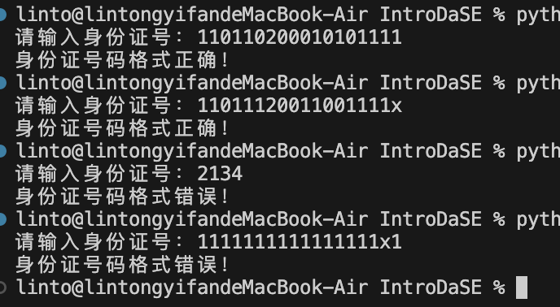
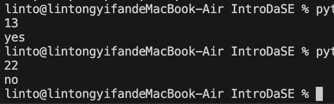

# This is the assignment of Chapter 3

## Section 1

## T1

[code](./3_T1.py)

## T2

[code](./3_T2.py)

## T3

[code](./3_T3.py)

## T4

[code](./3_T4.py)

## T5

[code](./3_T5.py)

## T6

[code](./3_T6.py)

## T7

- 运用了辗转相除法。

[code](./3_T7.py)

## T8

- 时间复杂度为O(n^2)的算法，如选择排序、冒泡排序在数列长度增加时，运行时间增长的速度比O(nlogn)的算法，如快速排序、归并排序快得多。同时，一些时间复杂度因数列不同而变化的排序算法，在数列较小时更可能会遇到最坏情况，运行时间会比O(n^2)的算法相似甚至更慢。

[code](./3_T8.py)

## T9

[code](./3_T9.py)

## Section 2

## T1

[code](./4_T1.py)

## T2

[code](./4_T2.py)

## T3

[code](./4_T3.py)

- 流程图

## T4

- 时间复杂度：O(nlogn),

- 空间复杂度：O(1).