# This is the assignment of chapter 5

## matplotlib绘图

代码位于 draw.py,draw1.py,draw2.py

## 6.7实践以及习题6.1

将实践中爬取豆瓣换为了爬取spec.org中一些数据的爬取

代码位于 spider.py. 实现了将网站spec.org中，关于cpu测试数据的一部分的爬取，并将结果存入csv文件以及数据库中。保存的csv文件为spider_spec_cfp2017.csv [保存的csv文件](spider_spec_cfp2017.csv)。数据库为introdase下的spec数据表，完成情况见图：

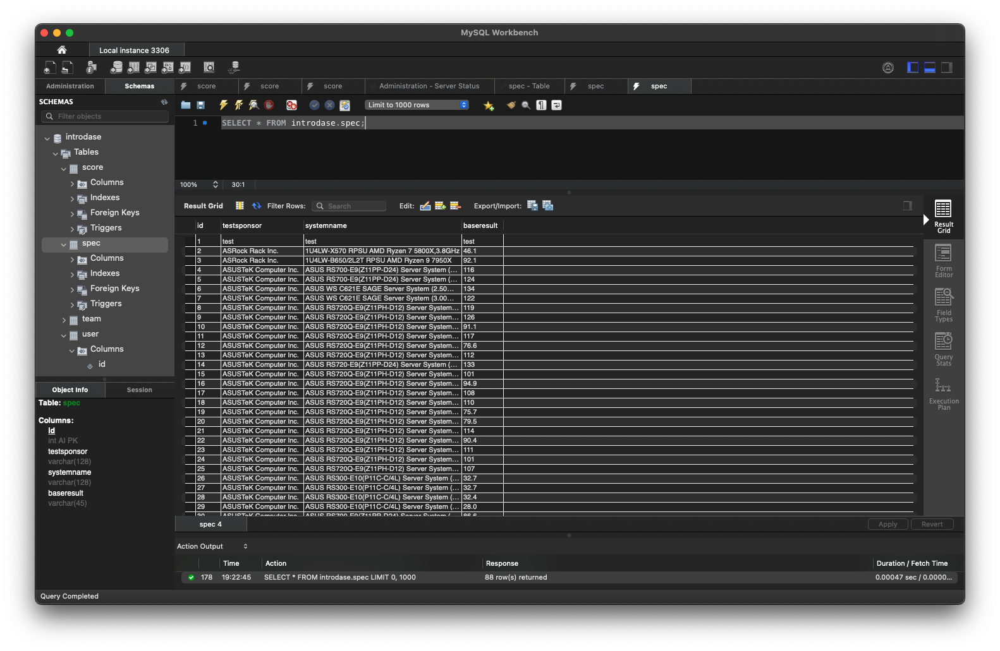

## 6.2

参考教程：[Scrapy入门教程](https://www.runoob.com/w3cnote/scrapy-detail.html)

使用Scrapy框架的优点有：

- 更容易构建大规模抓取项目
- 异步处理请求速度快
- 自动调节爬取速度
- 方便独立调试等

缺点有：

- 基于python的框架，拓展性较差
- 无法完成分布式爬取等

## 6.3

代码位于 dsSpider文件夹下。实现了对当当网中，关于计算机类书籍首页信息等等爬取，并将结果存为html和csv文件。

Scrapy 爬虫架构主要分为四部份：

   - 新建项目 (scrapy startproject xxx)：新建一个新的爬虫项目
   - 明确目标 （编写items.py）：明确你想要抓取的目标
   - 制作爬虫 （spiders/xxspider.py）：制作爬虫开始爬取网页
   - 存储内容 （pipelines.py）：设计管道存储爬取内容
 
还有其他主要文件：
   - scrapy.cfg: 项目的配置文件。
   - mySpider/: 项目的Python模块，将会从这里引用代码。
   - mySpider/items.py: 项目的目标文件。
   - mySpider/pipelines.py: 项目的管道文件。
   - mySpider/settings.py: 项目的设置文件。
   - mySpider/spiders/: 存储爬虫代码目录。

## 6.4

爬取了要求首页：https://book.dangdang.com/01.54.htm
的html文件，保存为 [IThome.html](./IThome.html) 文件

## 6.5

自动爬取了计算机类书籍的所有信息页面，保存在 [dangdangbook.csv](./dangdangbook.csv) 文件中。

为爬取不同页面的信息，在spider.py中定义了一个全新的爬虫，运用field语句的特性，迭代调用对某一页面某一书籍的爬取。实现了对任意多的页面中的书籍的爬取。
并在settings.py中定义了一个新的管道，将爬取的信息存入csv文件中。

## 实践7.5 

依照书包内容完成

## 7.1

配置安装了MySQL数据库以及配套的MySQL Workbench，实现了对数据库的增删改查等操作。

## 7.2

设定了一个符合要求的root用户。

## 7.3

完成要求如图所示：
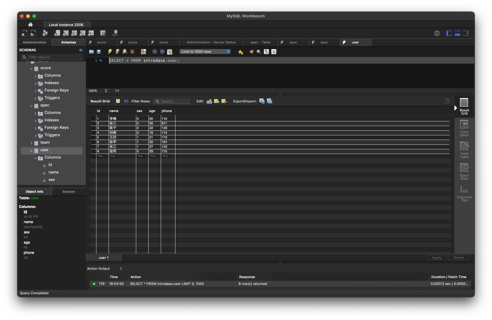

## 7.4

语句与查询结果如图所示：
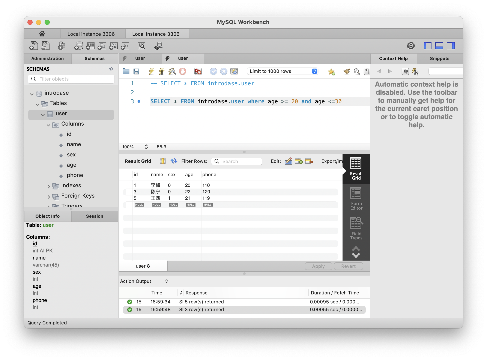

## 7.5

语句与查询结果如图所示：
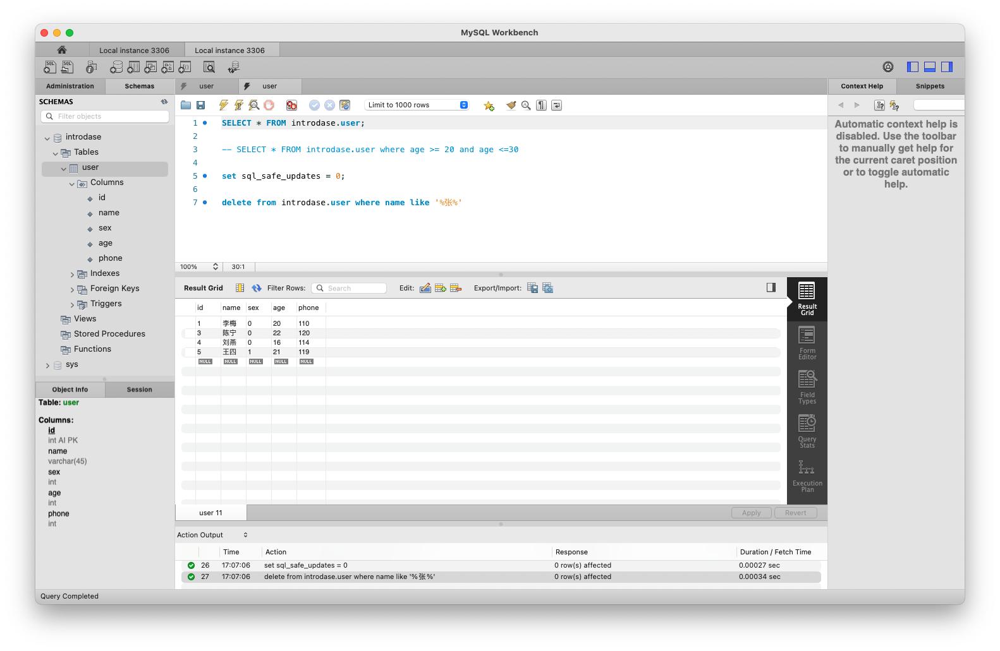

## 7.6

语句与查询结果如图所示：
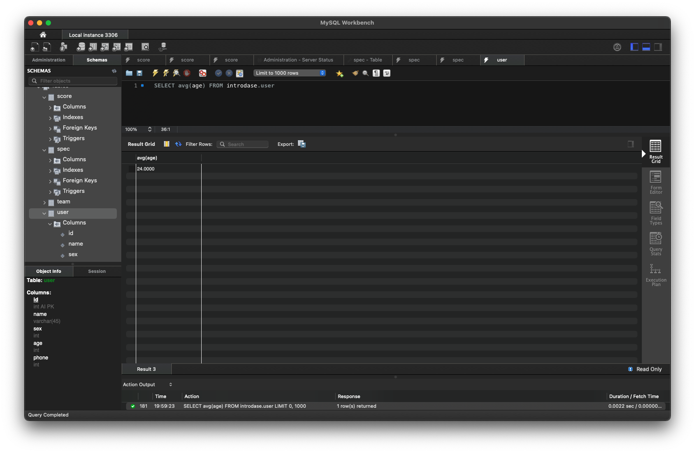

## 7.7

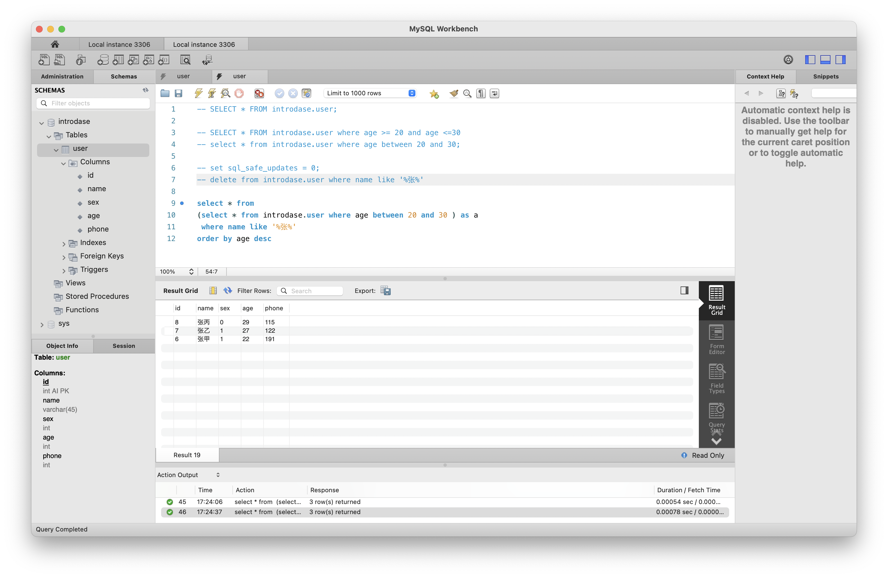

## 7.8

建立了表和插入数据的过程：

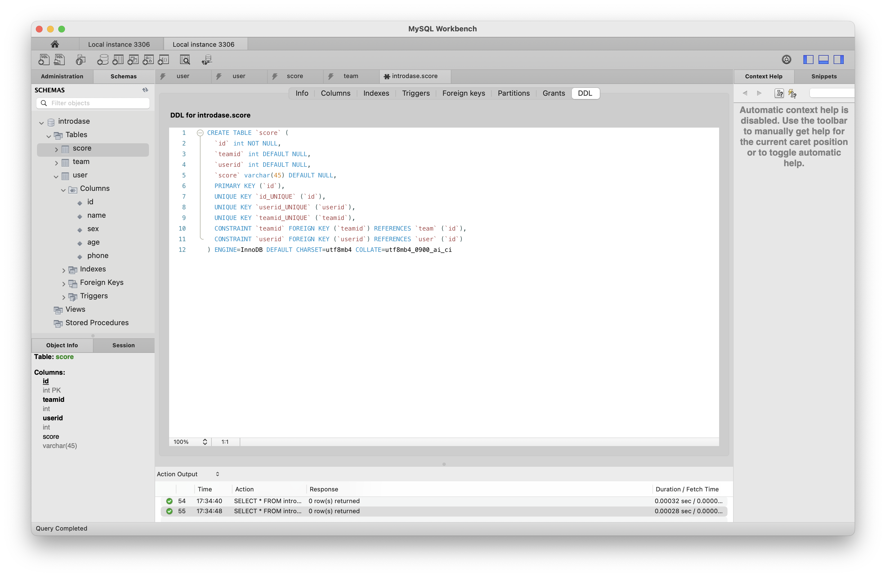
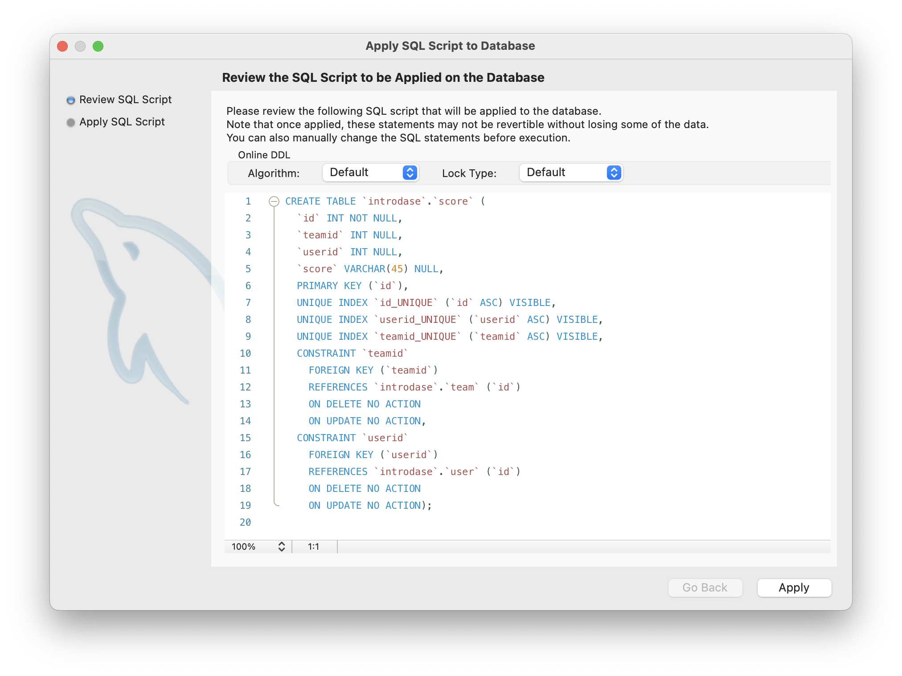
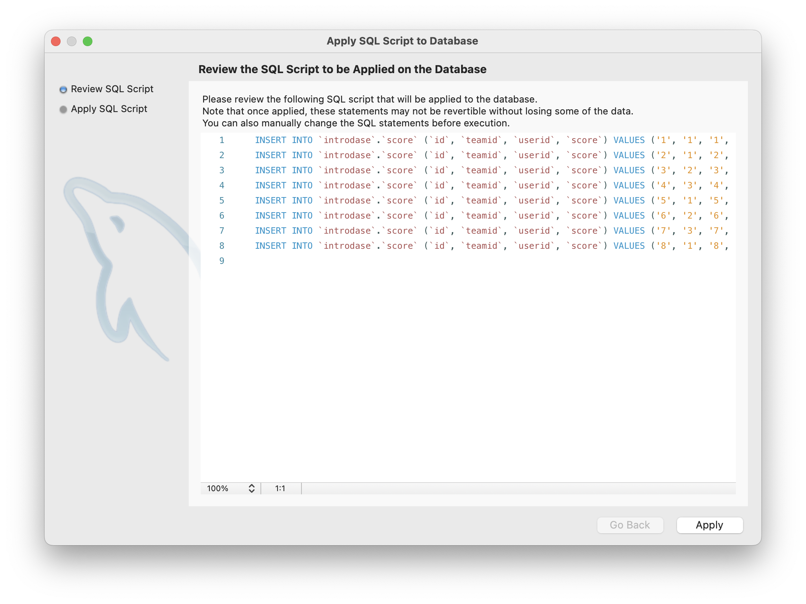
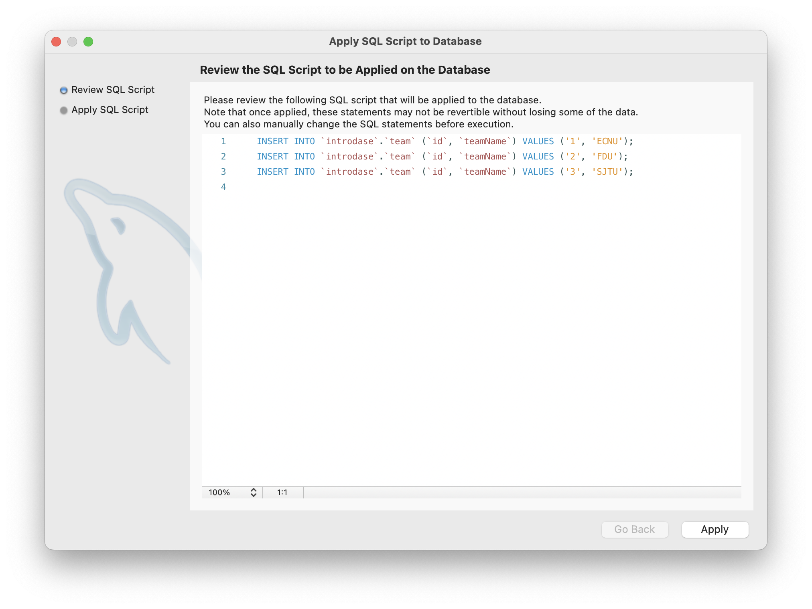

## 7.9

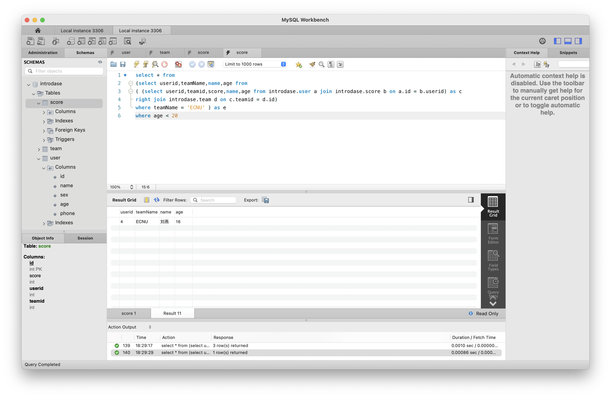

## 7.10

表中score的null值会被作为0加入计算：
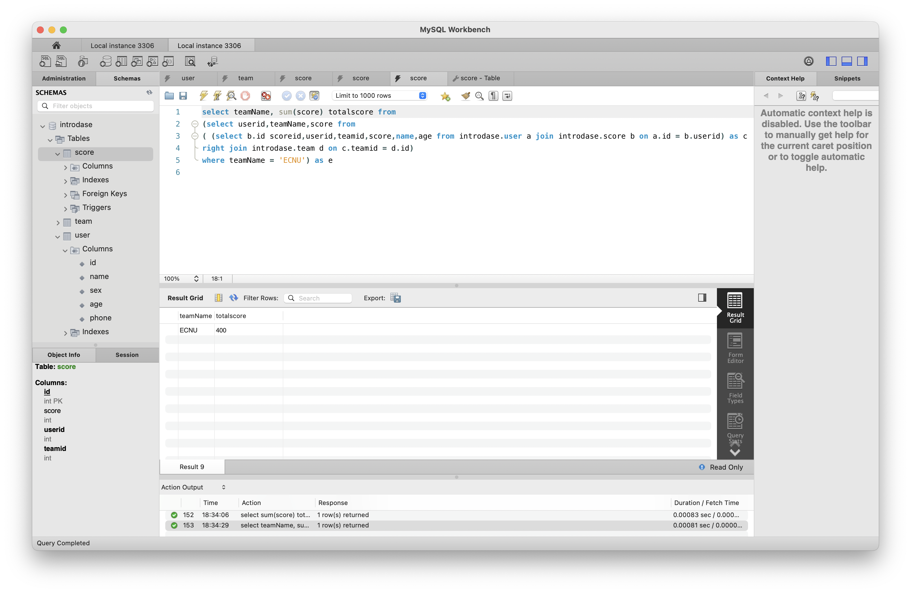