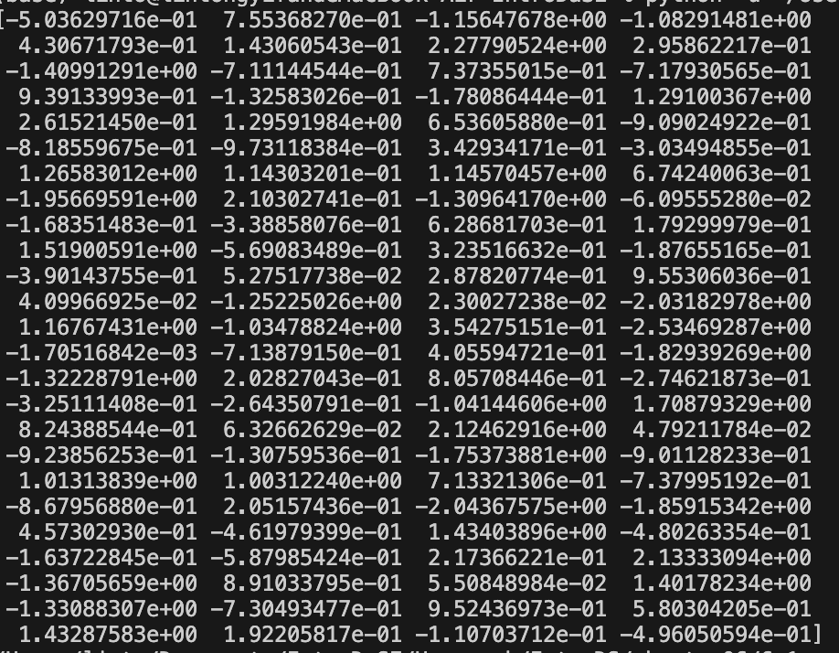
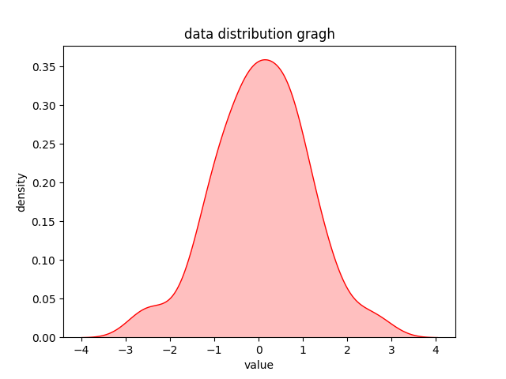

# This is the assignment of chapter 6

## 6.1

    import numpy
    import math
    import matplotlib.pyplot as plt

    num = 100
    samples = numpy.random.standard_normal(num)

    print(samples)

生成样本：

## 6.2

利用seaborn库，绘制出了样本的分布密度图。

    import numpy
    import math
    import matplotlib.pyplot as plt

    num = 100
    samples = numpy.random.standard_normal(num)

    import seaborn as sns

    # 绘制密度图
    sns.kdeplot(samples, shade=True, color='r')
    plt.title('data distribution gragh')
    plt.xlabel('value')
    plt.ylabel('density')

    plt.show()

绘制的图：

## 6.3

    import numpy as np

    A = np.array([[2,1],[4,5]])

    eva, evt = np.linalg.eigh(A)
    print("特征值为：", eva)
    print("特征向量为：", evt)

得出的结果：特征值为： -0.77200187, 特征向量为： (-0.82192562, 0.56959484).

特征值为：7.77200187, 特征向量为：(0.56959484, 0.82192562).

## 6.4

    import numpy as np

    A = np.array([[2, 1], [4, 5]])
    X = np.array([[1],[1]])

    def getEv(A, v):
        Av = np.array(np.dot(A, v))
        return np.vdot(Av,v) / np.vdot(v,v)

    X = X / np.vdot(X,X)
    # print(X)
    ev = getEv(A, X)

    while (1):
        temp = np.dot(A, X)
        temp = temp / np.vdot(temp,temp)

        newev = getEv(A, temp)
        if abs(ev - newev) <= 0.001:
            break
        X = temp
        ev = newev

    print(newev)

特征值：6.0001701966696395

## 6.5
    
    import numpy as np

    X = np.array([[1, -1, 4], [2, 1, 3], [1, 3, -1]])

    cov = np.cov(X)

    print(cov)

    # 计算协方差矩阵完成

结果：协方差矩阵为：

    [[ 6.33333333  2.5        -5.        ]

    [ 2.5         1.         -2.        ]

    [-5.         -2.          4.        ]]

## 6.6

    import numpy as np

    A = np.array([[1, -1, 4], [2, 1, 3], [1, 3, -1]])

    A = np.cov(A)

    def getEv(A, v):
        Av = np.array(np.dot(A, v))
        return np.vdot(Av, v) / np.vdot(v, v)

    i = 0
    while i < 3:
        X = np.array([[1], [1], [1]])
        X = X / np.vdot(X, X)
        ev = getEv(A, X)

        while (1):
            temp = np.dot(A, X)
            temp = temp / np.linalg.norm(temp)
            newev = getEv(A, temp)
            X = temp
            ev = newev
            if ev / newev <= 1.001 and ev / newev >= 0.999:
                i += 1
                A = A - newev * np.dot(X, X.T)
                break

        print(ev, X)

结果：特征值和对应的特征向量为：

    特征值：11.295860099928623 
    特征向量：[[ 0.75258299]
    [ 0.294489  ]
    [-0.58897799]]

    特征值：-3.2308849261350695e-15 
    特征向量：[[-0.75258299]
    [-0.294489  ]
    [ 0.58897799]]

    特征值：2.647193251329927e-17 
    特征向量：[[-0.75258299]
    [-0.294489  ]
    [ 0.58897799]]

## 实践10.5

统计词频：

[code](./6_7.py)

结果：

    the 20
    thou 19
    thy 19
    to 13
    s 12
    be 12
    and 11
    of 11
    his 10
    with 10
    thee 10
    beauty 9
    in 9
    thine 8
    And 7
    not 7
    Then 6
    But 5
    where 5

回归模型：

[code](./6_8.py)

由于波士顿房价预测集的一些问题，换成的加州房价预测集。

结果：

    训练集准确度： 0.6070888364926216
    测试集准确度： 0.6015507891610448