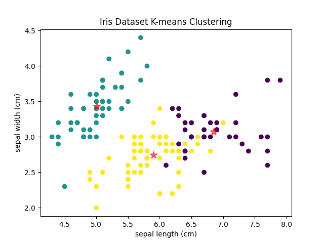
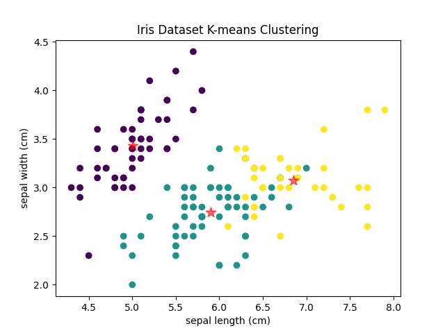
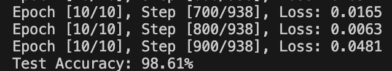

# This is the assignment of chapter 7

## 第十一章

### T5

   - 逻辑回归实现实际上就是将线性回归的计算结果加上了Sigmoid函数 
   $$ 
   \sigma(z) = \frac{1}{1 + e^{-z}} 
   $$
   将数值转换成概率。

   - 假设有`z = w^T X + b`，其中`w`是权重向量，`b`是偏差项，`z`是Sigmoid函数的参数。

   - 仿照线性回归的梯度下降公式可以得到`w`和`b`的梯度分别为：
  
   $$
   \frac{\partial J}{\partial w} = \frac{1}{N} \sum_{i=1}^{N} (\sigma(z^{(i)}) - y^{(i)})x^{(i)}
   $$
   $$
   \frac{\partial J}{\partial b} = \frac{1}{N} \sum_{i=1}^{N} (\sigma(z^{(i)}) - y^{(i)})
   $$

   - 仿照梯度下降法得到更新参数的方式：
   $$
   w = w - \alpha \frac{\partial J}{\partial w}
   $$
   $$
   b = b - \alpha \frac{\partial J}{\partial b}
   $$
   其中`α`控制步长，可以自行选取。

   - 通过多次迭代，用梯度不断得到新的参数，直到代价函数的变化已经很小为止。

### T6

   [代码](./7_1.py)

### T7

   [代码](./7_1.py)

### T8

   [代码](./7_2.py)

   输出结果：
   不同标签类别数据的中心点坐标依次为：
   [[5.005999999999999, 3.428000000000001], [5.936, 2.7700000000000005], [6.587999999999998, 2.9739999999999998]]
   第1个数据点到中心点的距离为：0.12
   第2个数据点到中心点的距离为：0.44
   第3个数据点到中心点的距离为：0.38
   第4个数据点到中心点的距离为：0.52
   第5个数据点到中心点的距离为：0.17
   第6个数据点到中心点的距离为：0.61
   第7个数据点到中心点的距离为：0.41
   第8个数据点到中心点的距离为：0.03
   第9个数据点到中心点的距离为：0.80
   ...
   第140个数据点到中心点的距离为：0.34
   第141个数据点到中心点的距离为：0.17
   第142个数据点到中心点的距离为：0.34
   第143个数据点到中心点的距离为：0.83
   第144个数据点到中心点的距离为：0.31
   第145个数据点到中心点的距离为：0.34
   第146个数据点到中心点的距离为：0.11
   第147个数据点到中心点的距离为：0.55
   第148个数据点到中心点的距离为：0.09
   第149个数据点到中心点的距离为：0.58
   第150个数据点到中心点的距离为：0.69

### T9

   [code](./7_3.py)

   输出结果：
   

## 第十二章

### T4

   [code](./7_4.py)

   输出结果：
   

### T5

   [code](./7_5.py)

   输出结果：

   

   这里以转换为1000*1000大小为例：

   

### T7

   [code](./7_6.py)

### T8

   [code](./7_6.py)

   这里以CIFAR-10数据集为例，将飞机、汽车、鸟、猫等的图像进行了分类，最终的准确率为98.61%。

   输出结果：
   
   

## 实践代码

   [code](./7_7.py)

   说明：其中的数据集待补充。