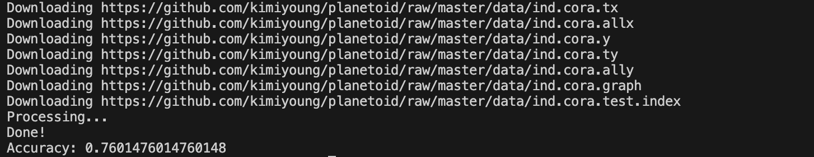

# This is the assignment of chapter08

## 第13章

### T1

    from sklearn.datasets import load_iris
    import sklearn
    import matplotlib.pyplot as plt

    iris = load_iris()

    X = iris.data
    y = iris.target

    # 绘制散点图
    plt.scatter(X[y==0, 0], X[y==0, 1], color='red', label=iris.target_names[0])
    plt.scatter(X[y==1, 0], X[y==1, 1], color='blue', label=iris.target_names[1])
    plt.scatter(X[y==2, 0], X[y==2, 1], color='green', label=iris.target_names[2])

    # 添加图例和标题
    plt.legend()
    plt.xlabel(iris.feature_names[0])
    plt.ylabel(iris.feature_names[1])
    plt.title('Iris Dataset Visualization')

    # 显示图像
    plt.show()

### T2

    from sklearn.datasets import load_iris
    from sklearn.model_selection import train_test_split
    from sklearn.neighbors import KNeighborsClassifier

    iris = load_iris()

    X_train, X_test, y_train, y_test = train_test_split(iris.data, iris.target, test_size=0.2)

### T3

    from sklearn.datasets import load_iris
    from sklearn.model_selection import train_test_split
    from sklearn.neighbors import KNeighborsClassifier

    iris = load_iris()

    X_train, X_test, y_train, y_test = train_test_split(iris.data, iris.target, test_size=0.2)

    knn = KNeighborsClassifier()
    knn.fit(X_train, y_train)

    y_accuracy = knn.score(X_test, y_test)
    X_accuracy = knn.score(X_train, y_train)
    print('test_accuracy: ', y_accuracy)
    print('train_accuracy: ', X_accuracy)

### T8

    from sklearn.feature_extraction.text import TfidfVectorizer
    from sklearn.naive_bayes import MultinomialNB
    from sklearn.pipeline import make_pipeline
    from sklearn.datasets import fetch_20newsgroups
    from sklearn.model_selection import train_test_split

    data = fetch_20newsgroups()
    X_train, X_test, y_train, y_test = train_test_split(data.data, data.target, test_size=0.2, random_state=42)

    model = make_pipeline(TfidfVectorizer(), MultinomialNB())

    model.fit(X_train, y_train)

    y_pred = model.predict(X_test)

    print("score =", model.score(X_test, y_test))

## 第14章

### 14.4实践

#### 实践1

    from wordcloud import WordCloud
    import matplotlib.pyplot as plt
    from PIL import Image
    import numpy as np

    stopwords = '的 了 是 有 个 人 在 也 和 与 中 为 以 这 之 但 并 于'.split()
    mask = np.array(Image.open('/Users/linto/Documents/IntroDaSE/Homework/IntroDS/chapter08/wordcloud.png'))
    text = open('/Users/linto/Documents/IntroDaSE/Homework/IntroDS/chapter08/wordcloud.txt', encoding='utf-8').read()

    wc = WordCloud(max_words = 1000, mask = mask, stopwords = stopwords, margin = 10, random_state = 1).generate(text)
    plt.imshow(wc, interpolation = 'bilinear')
    plt.axis('off')
    plt.show()

#### 实践2

    import keras
    import tensorflow as tf

    imdb = keras.datasets.imdb
    (train_data, train_labels), (test_data, test_labels) = imdb.load_data(num_words=10000)

    word_index = imdb.get_word_index()
    word_index = {k:(v+3) for k,v in word_index.items()}
    word_index["<PAD>"] = 0
    word_index["<START>"] = 1
    word_index["<UNK>"] = 2
    word_index["<UNUSED>"] = 3
    reverse_word_index = dict([(value, key) for (key, value) in word_index.items()])
    def decode_review(text):
        return ' '.join([reverse_word_index.get(i, '?') for i in text])

    # 用pad在句子后面补0，使得每个句子长度都为256
    train_data = keras.preprocessing.sequence.pad_sequences(train_data, value=word_index["<PAD>"], padding='post', maxlen=256)
    test_data = keras.preprocessing.sequence.pad_sequences(test_data, value=word_index["<PAD>"], padding='post', maxlen=256)

    vocab_size = 10000
    model = keras.Sequential()
    model.add(keras.layers.Embedding(vocab_size, 16))
    model.add(keras.layers.GlobalAveragePooling1D())
    model.add(keras.layers.Dense(16, activation=tf.nn.relu))
    model.add(keras.layers.Dense(1, activation=tf.nn.sigmoid))
    model.summary()

    model.compile(optimizer=tf.keras.optimizers.Adam(), loss='binary_crossentropy', metrics=['accuracy'])

    x_val = train_data[:10000]
    partial_x_train = train_data[10000:]
    y_val = train_labels[:10000]
    partial_y_train = train_labels[10000:]

    history = model.fit(partial_x_train, partial_y_train, epochs=40, batch_size=512, validation_data=(x_val, y_val), verbose=1)

    results = model.evaluate(test_data, test_labels)
    print(results)

### T2

    from sklearn.feature_extraction.text import CountVectorizer

    text = open('/Users/linto/Documents/IntroDaSE/Homework/IntroDS/chapter08/wordcloud.txt', encoding='utf-8').read()
    text = [text]
    vectorizer = CountVectorizer()
    X = vectorizer.fit_transform(text)
    print(X.toarray())
    print(vectorizer.get_feature_names_out())

### T3

    from sklearn.datasets import fetch_20newsgroups
    from sklearn.feature_extraction.text import TfidfVectorizer

    data = fetch_20newsgroups()
    tfidf = TfidfVectorizer()
    X= tfidf.fit_transform(data.data)

    print(X[0])

### T4

    from sklearn.feature_extraction.text import TfidfVectorizer
    from sklearn.naive_bayes import MultinomialNB
    from sklearn.pipeline import make_pipeline
    from sklearn.datasets import fetch_20newsgroups
    from sklearn.model_selection import train_test_split

    data = fetch_20newsgroups()
    X_train, X_test, y_train, y_test = train_test_split(data.data, data.target, test_size=0.2, random_state=42)

    model = make_pipeline(TfidfVectorizer(), MultinomialNB())

    model.fit(X_train, y_train)

    print("测试集准确度 =", model.score(X_test, y_test))
    print("训练集准确度 =", model.score(X_train, y_train))

### T5

    import librosa
    import numpy as np
    import matplotlib.pyplot as plt

    y, sr = librosa.load('/Users/linto/Documents/IntroDaSE/Homework/IntroDS/chapter08/audio.m4a')

    fft_result = np.fft.fft(y)

    freq = np.fft.fftfreq(len(y), 1/sr)

    plt.plot(freq, np.abs(fft_result))
    plt.show()

### T8 & T9

    from sklearn.naive_bayes import MultinomialNB
    from sklearn.model_selection import train_test_split
    from torch_geometric.datasets import Planetoid

    dataset = Planetoid(root='/Users/linto/Documents/IntroDaSE/Homework/IntroDS/chapter08/', name='cora')
    data = dataset[0]

    X = data.x.numpy()
    y = data.y.numpy()

    X_train, X_test, y_train, y_test = train_test_split(X, y, test_size=0.2, random_state=16)

    clf = MultinomialNB()
    clf.fit(X_train, y_train)

    accuracy = clf.score(X_test, y_test)
    print('Accuracy:', accuracy)

    from sklearn.neighbors import KNeighborsClassifier

    knn = KNeighborsClassifier(n_neighbors=5)

    # 训练kNN分类器
    knn.fit(X_train, y_train)

    accuracy = knn.score(X_test, y_test)
    print('Accuracy2:', accuracy)

    from sklearn.decomposition import PCA
    import matplotlib.pyplot as plt
    import numpy as np

    pca = PCA(n_components=2)
    # 对分类结果进行降维处理
    X_pred = knn.predict(X_train)
    X_pred = X_pred.reshape(-1, 1)
    X_pd = np.concatenate((X_train, X_pred), axis=1)

    X_train_pca = pca.fit_transform(X_pd)

    # 使用matplotlib库的scatter函数进行二维展示
    plt.figure(figsize=(8, 6))
    plt.scatter(X_train_pca[:, 0], X_train_pca[:, 1], c=y_train, cmap='rainbow')
    plt.show()

